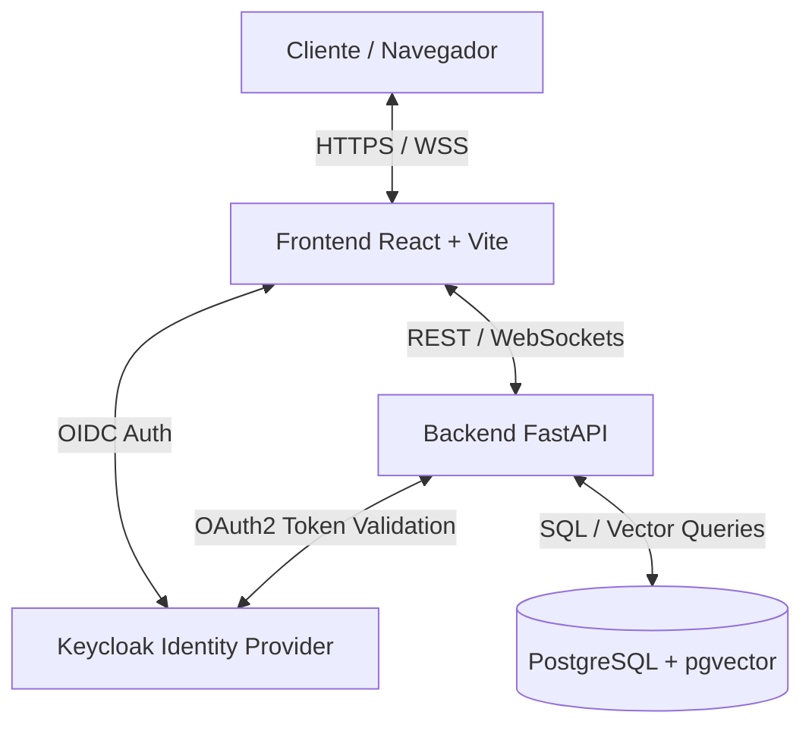

# Documento de Diseño de Software (SDD)
## Plataforma Global de Inteligencia Logística e Inventario - Nike Inc.

---

## 1. Introducción y Objetivos
Este documento define el diseño arquitectónico y las especificaciones técnicas para la **Plataforma Global de Inteligencia Logística e Inventario** diseñada para Nike Inc. La plataforma tiene como objetivo centralizar la gestión de inventarios multisede, proveer seguimiento en tiempo real (GPS/IoT), agilizar movimientos de mercancía a través de interfaces Drag-and-Drop y ofrecer un Asistente Logístico Inteligente (Chatbot IA).

### Objetivos Principales:
* **Ecosistema Multi-site:** Visibilidad unificada en miles de almacenes y tiendas físicas de Nike.
* **Trazabilidad Omnicanal:** Monitoreo multimodal de envíos en tiempo real con ETA predictivo.
* **Chatbot de Consulta Rápida:** Interfaz conversacional con procesamiento semántico avanzado mediante PostgreSQL y `pgvector` para buscar lotes, consultar ubicaciones y escanear códigos QR.
* **Control Visual:** Centro de comando intuitivo para la reubicación de mercancía mediante Drag-and-Drop, simulando el impacto operativo.

---

## 2. Arquitectura de Software por Capas (Layered Architecture)
Para asegurar la mantenibilidad y escalabilidad, el proyecto se divide estrictamente en dos servicios principales con una organización interna por capas de responsabilidad única.



### 2.1. Frontend (React + Vite + Shadcn/UI)
Estructura de directorios basada en responsabilidades por capas:
```text
frontend/
├── public/
├── src/
│   ├── assets/             # Recursos estáticos (imágenes, logos)
│   ├── components/         # Componentes UI reutilizables (Botones, Inputs, Cards de Shadcn)
│   ├── features/           # Módulos del negocio
│   │   ├── dashboard/      # Vista global multisede
│   │   ├── tracking/       # Mapa interactivo y rutas
│   │   ├── chatbot/        # Ventana del chat y escaneo
│   │   └── command-center/ # Panel Drag-and-Drop
│   ├── hooks/              # Hooks personalizados (useAuth, useSocket, etc.)
│   ├── layouts/            # Plantillas de diseño de páginas
│   ├── services/           # Capa de API y peticiones HTTP (Axios/Fetch)
│   ├── store/              # Estado global (Zustand / Redux Toolkit)
│   ├── utils/              # Funciones auxiliares y formateadores
│   ├── App.tsx             # Componente raíz y enrutador
│   └── main.tsx            # Punto de entrada
```

### 2.2. Backend (FastAPI)
Estructura de directorios organizada en capas lógicas:
```text
backend/
├── app/
│   ├── api/                # CAPA DE ENTRADA: Controladores y Rutas API (Endpoints REST & WebSockets)
│   │   ├── v1/
│   │   │   ├── auth.py
│   │   │   ├── inventory.py
│   │   │   ├── tracking.py
│   │   │   └── chatbot.py
│   ├── core/               # CAPA DE CONFIGURACIÓN: Ajustes globales, seguridad, Keycloak config y base de datos
│   │   ├── config.py
│   │   ├── security.py
│   │   └── database.py
│   ├── services/           # CAPA DE NEGOCIO: Lógica de negocio principal y orquestación
│   │   ├── inventory_service.py
│   │   ├── tracking_service.py
│   │   └── chatbot_service.py
│   ├── repositories/       # CAPA DE ACCESO A DATOS: Consultas SQL y operaciones vectoriales
│   │   ├── inventory_repository.py
│   │   └── vector_repository.py
│   ├── models/             # Modelos de Base de Datos (SQLAlchemy)
│   │   ├── inventory.py
│   │   └── chat_context.py
│   ├── schemas/            # Esquemas de Validación (Pydantic)
│   │   ├── inventory.py
│   │   └── chatbot.py
│   └── main.py             # Punto de entrada de FastAPI
├── tests/                  # Pruebas unitarias e integración
└── requirements.txt
```

---

## 3. Integración de Servicios Clave

### 3.1. Autenticación y Autorización con Keycloak
* **Protocolo:** OpenID Connect (OIDC) y OAuth 2.0.
* **Flujo Frontend:** Redirección mediante el cliente `keycloak-js`. El token JWT se almacena de forma segura en memoria y se envía en las cabeceras HTTP (`Authorization: Bearer <token>`).
* **Flujo Backend:** FastAPI intercepta cada petición mediante un middleware de seguridad, valida la firma del token JWT directamente contra Keycloak o su clave pública expuesta (JWKS) y extrae los roles/permisos del usuario para realizar la validación RBAC.

### 3.2. Asistente Logístico con PostgreSQL + pgvector
* **Motor Vectorial:** PostgreSQL usando la extensión `pgvector` para almacenar las representaciones vectoriales (embeddings) de los datos de inventario y manuales operativos de Nike.
* **Proceso de Búsqueda Semántica:**
  1. El backend convierte la consulta de lenguaje natural del usuario (ej: *"¿Dónde están las Air Max talla 10 rojas?"*) en un vector utilizando un modelo local o servicio LLM.
  2. Se realiza una consulta de similaridad de coseno en Postgres utilizando el operador `<=>` contra la columna vectorial.
  3. Los registros más relevantes se inyectan en el prompt del chatbot para formular una respuesta rica en contexto estructurado.

---

## 4. Estrategia de Seguridad

### 4.1. OWASP Top 10 (Seguridad General)
1. **A01: Broken Access Control:** Validación estricta a nivel de base de datos e inquilinos (`tenant_id`). Keycloak gestiona los alcances (scopes).
2. **A02: Cryptographic Failures:** Uso estricto de HTTPS (TLS 1.3). Hashing robusto para cualquier credencial local.
3. **A03: Injection:** FastAPI y SQLAlchemy previenen inyecciones SQL mediante consultas parametrizadas.
4. **A05: Security Misconfiguration:** Deshabilitación de interfaces de desarrollo en producción. Cabeceras HTTP seguras (CORS estricto, CSP).
5. **A09: Security Logging and Monitoring Failures:** Logs estructurados y centralizados para rastrear accesos no autorizados o fallos críticos.

### 4.2. OWASP LLM Top 10 (Seguridad del Chatbot IA)
1. **LLM01: Prompt Injection:** Sanitización y validación estricta de las entradas del usuario antes de enviarlas al modelo LLM. Uso de system prompts restrictivos y delimitadores de contexto.
2. **LLM02: Insecure Output Handling:** Escapado y renderización segura de las respuestas generadas por la IA para prevenir ataques XSS indirectos en el Frontend.
3. **LLM06: Sensitive Information Disclosure:** Filtrado de datos confidenciales del sistema antes de enviar la información al contexto de LLM.

---

## 5. Pruebas E2E y Automatización
* **Herramienta:** Playwright (Python o Javascript) configurado en `/tests/e2e/`.
* **Prueba Principal:** Flujo completo de redistribución mediante Drag-and-Drop y verificación de la actualización del stock a través del chat de la plataforma.
* **Automatización:** Ejecución en modo headless con reportes detallados en formato HTML.

---

## 6. Pipeline CI/CD con Gitea Actions
El flujo de despliegue se automatizará usando los runners de **Gitea Actions** (`.gitea/workflows/deploy.yml`):
* **Fase de Integración:** Compilación del frontend, linting, tests unitarios en el backend.
* **Fase de Despliegue:** Construcción de imágenes Docker y despliegue automatizado en entornos de staging/producción.
