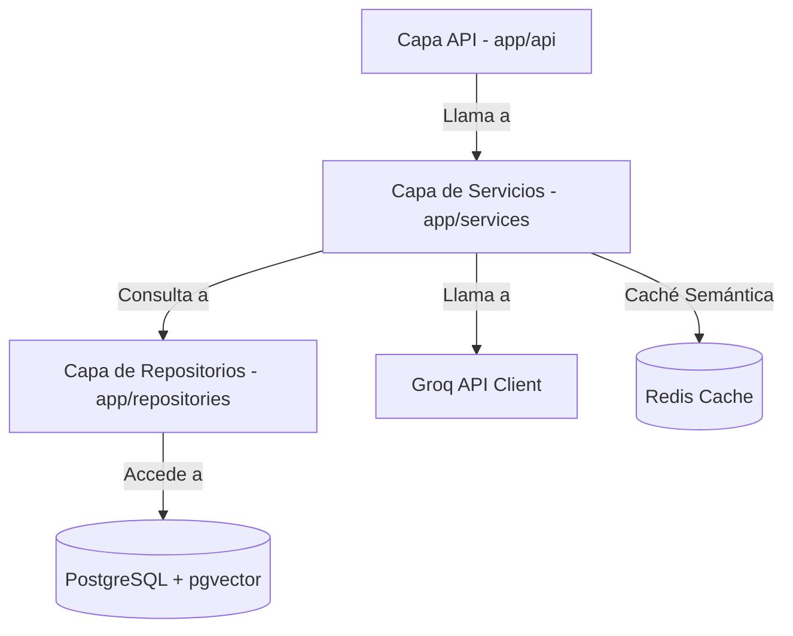

# Documento de Diseño de Software (SDD) - Backend
## Servicio de API, Datos e Inteligencia Logística (FastAPI)

---

## 1. Introducción y Arquitectura General
El backend está diseñado como una API REST y WebSocket asíncrona utilizando **FastAPI (Python)**. Sigue una **arquitectura por capas** estricta para separar las responsabilidades de enrutamiento, lógica de negocio y persistencia de datos.

### Capas del Servicio Backend:
1. **API Layer (`app/api/`)** `[Responsabilidad: BE_DEV_1]`: Controla las rutas, payloads de entrada/salida (Pydantic), protocolos REST y WebSockets.
2. **Core Layer (`app/core/`)** `[Responsabilidad: BE_DEV_1]`: Configuraciones, variables de entorno, seguridad, y clientes de bases de datos.
3. **Services Layer (`app/services/`)** `[Responsabilidad: BE_DEV_2]`: Lógica del negocio, cálculo del ETA de envío, filtrado de stock y orquestación del chatbot de IA.
4. **Repositories Layer (`app/repositories/`)** `[Responsabilidad: DB_MGR / BE_DEV_1]`: Operaciones CRUD complejas, auditoría de eventos y consultas de similitud vectorial.
5. **Models Layer (`app/models/`)** `[Responsabilidad: DB_MGR]`: Definición de esquemas relacionales, tablas de auditoría e índices vectoriales en SQLAlchemy.

---

## 2. Autenticación, Matriz de Roles y Simulación (DEMO_MODE) `[Responsabilidad: BE_DEV_1]`
El backend valida tokens JWT de Keycloak y extrae los roles configurados en la organización:

| Rol | Permisos en Backend | Comportamiento en la Demo |
| :--- | :--- | :--- |
| **Administrador** | Acceso total a CRUD de inventarios, simulación Drag-and-Drop, consultas y auditoría. | Puede reubicar mercancía de cualquier país. |
| **Supervisor** | Lectura total, ejecución de Drag-and-Drop en su región, consultas al Chatbot. | Puede redistribuir stock local pero no internacional. |
| **Operador** | Lectura local, escaneo QR y consultas de stock en Chatbot. | Bloqueado el módulo Drag-and-Drop. |

### Particularidad Evaluativa: Modo Demo Híbrido (`DEMO_MODE=True`)
* Para simplificar la revisión local de la docente sin obligarla a desplegar un contenedor Keycloak configurado, el backend soporta la variable de entorno `DEMO_MODE=True`.
* Cuando está activa, se deshabilita la verificación de firma externa del JWT de Keycloak. El backend acepta tokens simulados o una cabecera HTTP de conveniencia `X-Demo-Role` que sobreescribe los permisos en el contexto de la petición.

---

## 3. Base de Datos PostgreSQL, pgvector y Script de Semillero (Seeding) `[Responsabilidad: DB_MGR]`
* **pgvector:** Utiliza el tipo `vector` para guardar embeddings de descripciones de productos y manuales operativos de Nike.
* **Semillero Inteligente (`seed.py`):**
  - Implementa un script que autogenera registros estructurados en Postgres.
  - Carga lotes de calzado Nike reales (ej: SKU `NIKE-AJ1-001` - Air Jordan 1, SKU `NIKE-AM90-002` - Air Max 90) con descripciones técnicas.
  - Inserta coordenadas geográficas realistas (longitud/latitud) para representar ubicaciones físicas de almacenes y camiones de carga de Nike en tránsito.
  - Pre-calcula los embeddings de las descripciones (usando SentenceTransformers localmente) para que la búsqueda semántica funcione directamente.

---

## 4. Caché Semántica con Redis `[Responsabilidad: BE_DEV_2]`
* Para optimizar costos y tiempos de respuesta, se introduce **Redis** en la capa de servicios del Chatbot.
* Cuando entra una consulta, se calcula su embedding y se compara (usando distancia euclidiana en Redis) contra un historial de preguntas almacenadas en caché.
* Si hay una coincidencia con alta similitud (ej: similitud > 95%), se sirve directamente la respuesta de caché evitando la llamada API a Groq.

---

## 5. Tabla de Auditoría Logística (Audit Logs) `[Responsabilidad: DB_MGR / BE_DEV_1]`
Para garantizar la integridad y la trazabilidad requeridas por la industria (OWASP A01), se implementa un modelo de datos `AuditLog`:
* **Campos:** `id` (UUID), `user_id` (UUID), `user_email` (str), `action` (str, ej: "TRASLADO_CONFIRMADO"), `details` (JSON, ej: origen, destino, SKU, cantidad), `timestamp` (datetime).
* **Funcionamiento:** Cada acción de Drag-and-Drop que resulte en una orden de traslado confirmada se registrará automáticamente de manera inmutable en esta tabla.

---

## 6. Integración de la API de Groq y Seguridad LLM `[Responsabilidad: BE_DEV_2]`
* **Groq API:** Interacción directa con modelos rápidos de inferencia como `llama3-8b-8192` con latencias inferiores a 500ms.
* **Medidas de Seguridad (LLM Top 10):**
  - **LLM01 (Prompt Injection):** El backend sanitiza los queries removiendo palabras clave y limitadores de contexto como `System:`, `User:`, o comandos de redirección de comportamiento.
  - **LLM02 (Insecure Output Handling):** La respuesta del chatbot es procesada por un filtro para sanitizar cualquier intento de inyección de código JavaScript o scripts XSS antes de viajar al frontend.
